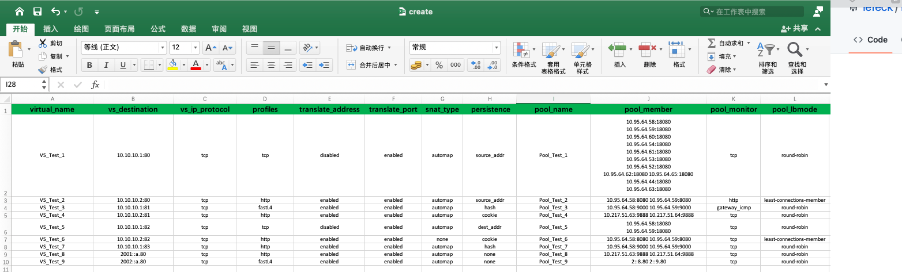

# f5ltm
Bulk upload configuration parameters to f5ltm


# Basic Usage
## Installation

```cgo
git clone https://github.com/lefeck/f5ltm.git
```

## view excel sheet


## Reading spreadsheet to f5ltm
The following constitutes the bare to read a spreadsheet document.
```cgo
johnny@Host-By f5ltm % ./ltm -h
Usage of /var/folders/1x/7k2pwl1d5fb9vms2t32fxw4c0000gn/T/go-build2527495293/b001/exe/main:
  -a string
        the host ip address. (default "192.168.1.1")
  -f string
        specifies an alternative configuration file. (default "/tmp/test.xlsx")
  -p string
        specifies the password of login host. (default "admin")
  -s string
        specifies the table name of the workbook. (default "Sheet1")
  -u string
        specifies the username of login host. (default "admin")

johnny@Host-By f5ltm % ./ltm -a 192.168.10.84 -f ./create.xlsx
virtualserver name Vs_GZGL_APP_18080 create success.
virtualserver name Vs_GZGL_APP_8080 create success.
virtualserver name Vs_GZGL_APP_9000 create success.
virtualserver name Vs_GZGL_APP_9888 create success.
```
