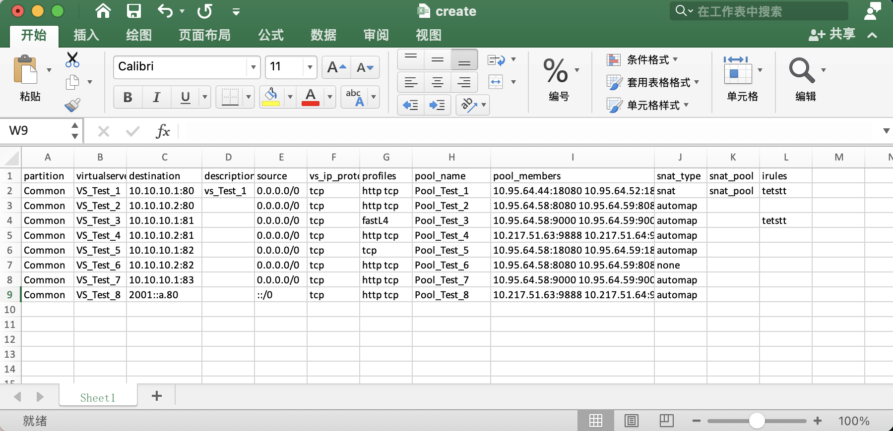

# f5ltm
* Bulk upload configuration parameters to f5 bigip
* Read f5 bigip configuration to excel


# Basic Usage
## Installation

```cgo
git clone https://github.com/lefeck/f5ltm.git
```

## view excel sheet
You should customize the value in the cell according to the header specified by the excel sheet, and make sure it is correct. As shown in the following excel sheet:


## Reading spreadsheet to f5 bigip
The following constitutes the bare to read a spreadsheet document.
```cgo
johnny@Host-By f5ltm % ./ltm -h                 
ltm controls the f5 bigip devices.
  _____  ____   _    _____  __  __ 
 |  ___|| ___| | |  |_   _||  \/  |
 | |_   |___ \ | |    | |  | |\/| |
 |  _|   ___) || |___ | |  | |  | |
 |_|    |____/ |_____||_|  |_|  |_|

Usage:
  ltm [flags]
  ltm [command]

Available Commands:
  completion  Generate the autocompletion script for the specified shell
  help        Help about any command
  read        Read the excel configuration and load it to the f5 device
  version     Show ltm version
  write       Read f5 device data and write to excel sheet

Flags:
  -h, --help   help for ltm

Use "ltm [command] --help" for more information about a command.

johnny@Host-By f5ltm % ./ltm read -h
Read the excel configuration and load it to the f5 device

Usage:
  ltm read [flags]

Flags:
  -f, --file string       Specifies an alternative configuration file (default "/tmp/pkg.xlsx")
  -h, --help              help for read
  -a, --host string       The host ip address (default "127.0.0.1")
  -p, --password string   Password for the given user (default "admin")
  -s, --sheet string      Specifies the table name of the workbook (default "Sheet1")
  -u, --username string   The username of the host (default "admin")

johnny@Host-By f5ltm % ./ltm read -a 192.168.10.84 -f ./create.xlsx
virtualserver name Vs_GZGL_APP_18080 create success.
virtualserver name Vs_GZGL_APP_8080 create success.
virtualserver name Vs_GZGL_APP_9000 create success.
virtualserver name Vs_GZGL_APP_9888 create success.
```

## Read f5 bigip configuration to excel sheet
```cgo
johnny@Host-By f5ltm % ./ltm write -h
Read f5 device data and write to excel sheet

Usage:
  ltm write [flags]

Flags:
  -f, --file string       Specifies an alternative configuration file (default "/tmp/create.xlsx")
  -h, --help              help for write
  -a, --host string       The host ip address (default "127.0.0.1")
  -p, --password string   Password for the given user (default "admin")
  -s, --sheet string      Specifies the table name of the workbook (default "Sheet1")
  -u, --username string   The username of the host (default "admin")

johnny@Host-By f5ltm % ./ltm write -a 192.168.10.84 -f ./create.xlsx
```
# view excel sheet

