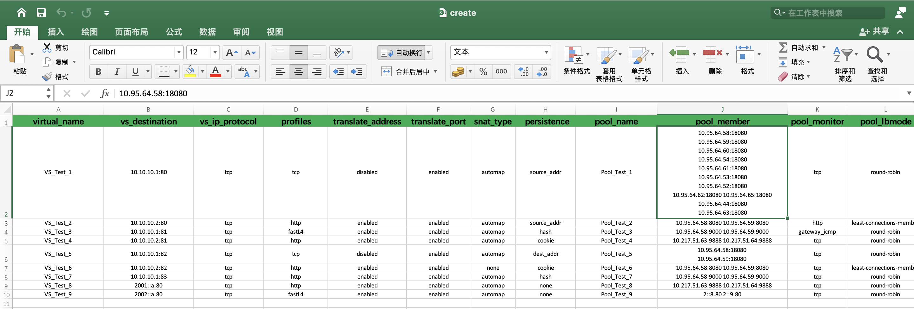

# f5ltm
* Bulk upload configuration parameters to f5 bigip
* Read f5 bigip configuration to excel


# Basic Usage
## Installation

```cgo
git clone https://github.com/lefeck/f5ltm.git
```

## view excel sheet
You should customize the value in the cell according to the header specified by the excel sheet, and make sure it is correct. As shown in the following excel sheet:



## Reading spreadsheet to f5 bigip
The following constitutes the bare to read a spreadsheet document.
```cgo
johnny@Host-By f5ltm % ./ltm -h                 
NAME:
   ltm - ltm controls the f5 bigip devices.
           _____  ____   _    _____  __  __ 
          |  ___|| ___| | |  |_   _||  \/  |
          | |_   |___ \ | |    | |  | |\/| |
          |  _|   ___) || |___ | |  | |  | |
          |_|    |____/ |_____||_|  |_|  |_|
                                            
         

USAGE:
   ltm [global options] command [command options] [arguments...]

VERSION:
   2.0

AUTHOR:
   Johnny Wilson <jw6759792@gmail.com>

COMMANDS:
   import   
   export   
   help, h  Shows a list of commands or help for one command

GLOBAL OPTIONS:
   --help, -h     show help (default: false)
   --version, -v  print the version (default: false)

johnny@Host-By f5ltm % ./ltm import -h
NAME:
   ltm import

USAGE:
   ltm import [command options] [arguments...]

DESCRIPTION:
   Read the excel configuration and load it to the f5 device

OPTIONS:
   --file value, -f value      This file is used for read or write operations. (default: "./ltm.xlsx")
   --host value, -a value      Enter the address to connect to the remote host. (default: "127.0.0.1")
   --password value, -p value  Password to connect to the remote host. (default: "admin")
   --sheet value, -s value     The table name of the workbook. (default: "Sheet1")
   --username value, -u value  Username to connect to the remote host. (default: "admin")

johnny@Host-By f5ltm % ./ltm import -a 192.168.10.84 -f ./create.xlsx
virtualserver name Vs_GZGL_APP_18080 create success.
virtualserver name Vs_GZGL_APP_8080 create success.
virtualserver name Vs_GZGL_APP_9000 create success.
virtualserver name Vs_GZGL_APP_9888 create success.
```

## Read f5 bigip configuration to excel sheet
```cgo
johnny@Host-By f5ltm % ./ltm export -h
NAME:
   ltm export

USAGE:
   ltm export [command options] [arguments...]

DESCRIPTION:
   Read f5 device data and write to excel sheet

OPTIONS:
   --file value, -f value      This file is used for read or write operations. (default: "./ltm.xlsx")
   --host value, -a value      Enter the address to connect to the remote host. (default: "127.0.0.1")
   --password value, -p value  Password to connect to the remote host. (default: "admin")
   --sheet value, -s value     The table name of the workbook. (default: "Sheet1")
   --username value, -u value  Username to connect to the remote host. (default: "admin")

johnny@Host-By f5ltm % ./ltm export -a 192.168.10.84 -f ./create.xlsx
```
# view excel sheet

